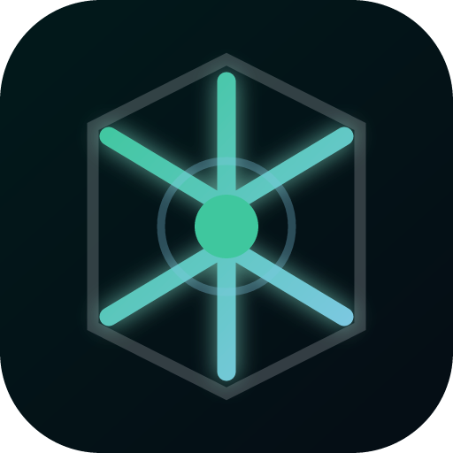
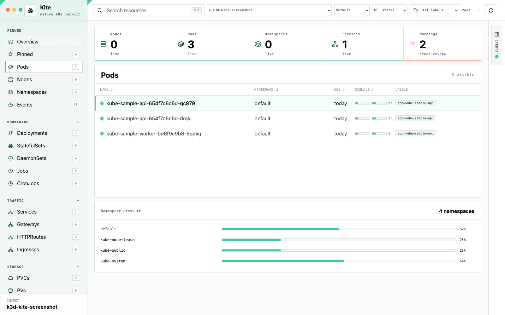

<p align="center">
  
</p>

<h1 align="center">Kite</h1>

<p align="center">
  A native, UI-first Kubernetes cockpit for developers debugging real clusters.
</p>

[](https://github.com/rootsec1/kite/actions/workflows/ci.yml)
[](LICENSE)
[](https://tauri.app)
[](https://kube.rs)
[](https://bun.sh)

Kite is a native, UI-first Kubernetes cockpit built with Tauri, Rust, React, and Bun.

The product moat is the interface: a simple native control-plane lens, macOS glass, reusable motion, and guarded Kubernetes actions without dashboard clutter.



## Highlights

- Native macOS-first app shell built with Tauri 2.
- Live Kubernetes resource inventory with namespace, status, label, search, sorting, and pressure signals.
- Persistent pinned resources for fast returns to active incidents.
- Grouped drilldowns from namespaces, services, workloads, and pods.
- Pod debugging workspace with status, containers, events, searchable level-filtered logs, exec command handoff, guarded restart, and guarded delete.
- Local-first architecture with no cluster-side agent.
- Guarded write model for risky Kubernetes actions.

## Principles

- Local-first Kubernetes inspection with no cluster-side agent.
- Developer debugging workflows over generic dashboard clutter.
- Guarded writes: destructive actions must show the exact cluster, namespace, resource, and risk.
- No writes to non-local clusters during development or tests.

## Development

```bash
bun install
bun run dev
```

Prerequisites:

- Bun
- Rust stable
- Tauri system dependencies
- `kubectl`
- Optional local cluster: k3d, kind, minikube, or Docker Desktop Kubernetes

## Local Kubernetes Demo

```bash
chmod +x scripts/k3d-demo.sh
scripts/k3d-demo.sh
```

## Validation

```bash
bun run build
cd src-tauri && cargo check
```

## macOS Packaging

```bash
bun run tauri:build
```

Release artifacts are written to `src-tauri/target/release/bundle/macos/Kite.app` and `src-tauri/target/release/bundle/dmg/`.
Public distribution still requires an Apple Developer signing identity and notarization.

## Contributing

See [CONTRIBUTING.md](CONTRIBUTING.md). All contributors are expected to follow the [Code of Conduct](CODE_OF_CONDUCT.md).

## Security

Please report vulnerabilities through GitHub private vulnerability reporting or the process in [SECURITY.md](SECURITY.md).
